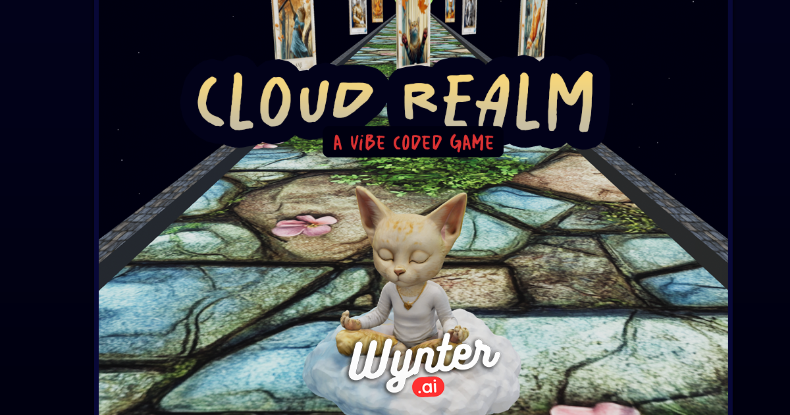

# Cloud Realm

A fantasy battle game where you fight against your own mind.

## About the Game

Cloud Realm is an immersive fantasy game where players choose their weapons, armor, and magic to engage in epic battles against manifestations of their own consciousness. Navigate through mystical realms and overcome inner demons as you discover the power that lies within.

## Features

- Choose from a variety of weapons to match your combat style
- Equip different armor types for unique defensive capabilities
- Master magical abilities that evolve with your journey
- Auto battle your mind! (...you always win)

## How to Play

1. Select your preferred weapon
2. Choose your armor
3. Pick your magical abilities
4. Enter the Cloud Realm and begin your journey
5. Battle against manifestations of your mind

## Development

Cloud Realm was developed for Vibe Jam 2025.

## Technologies Used

- Midjourney
- Udio
- Meshy
- Cursor
- ElevenLabs

## Credits

Made by Wynter Jones
